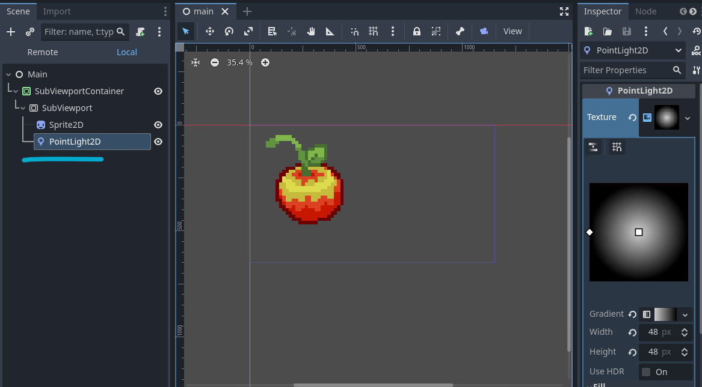

# PickyPixels

Pixel-perfect control over colors and lighting in the [Godot Engine]("https://godotengine.org/")
(version 4.2 or later).

This plugin is used for game devs who want to make a game using a pixel art with a strict color
palette, and who want to control how sprites behave based on lighting. With PickyPixels, you can
create different versions of a sprite based on how "well-lit" it is, configure a texture within
the plugin's UI, and it will handle the rest for you.

**Disclaimer: This plugin is in its early stages! There may be major bugs, and future versions**
**may not be compatible with previous versions.**

## Current Features

- Configurable lighting behavior for 2D textures.
- Simple texture library and editor.
- Easy-access color palette.

## Future Features

- 3D Support.
- Effects such as dithering and outlining.
- Updating color palettes for all textures at once.
- Multiple color palettes.
- Texture "variations" that can be swapped in real time.
- Ease-of-use updates based on new Godot features.
- More color ramps. (See [How it works](#how-it-works) for what this means.)

# Getting Started

- [Installation](#installation)
- [Setting up](#setting-up)
- [Creating textures](#creating-textures)
- [Using textures](#using-textures)
- [How it works](#how-it-works)

## Installation

**This plugin was written in Godot v4.2, so it may not work with earlier versions!**

1. Download the zip from the latest release on the
[releases](https://github.com/auranym/picky-pixels/releases) page.

2. Within your project, extract the `picky-pixels` folder into your `addons` folder.
  If your project does not have an `addons` folder, create one first.
  This will create a new folder called `picky_pixels` within your project's root.
  You may also see some errors in the console, but they can be ignored. At this point,
  your project should look something like this:

  
3. **Restart Godot.** Then, enable the plugin by going to **Project->Project Settings**,
  in the **Plugins** tab. You should now see a new editor tab called PickyPixels.

You are now ready to start using PickyPixels!

## Setting up

Before anything, it is recommended to set the default texture filter to "Nearest" within your
Godot project settings. This keeps pixels sharp and defined. Do this by going to
**Project->Project Settings**, in the **General** tab. Search for **"Default Texture Filter"**
and set the value to **"Nearest"**.

Due to some missing features within Godot related to low-level rendering (such as
[shader templates](https://github.com/godotengine/godot-proposals/issues/8366)),
PickyPixels requires some extra setup to work correctly.

### Color palette

First, your game must have a color palette in the form of a PNG file. This file does not have to
look like anything in particular, but it must have *every color within your color palette*.
I recommend keeping this file within your game's project files, but it does not have to be.

Once you have your color palette PNG file handy, load it into PickyPixels by clicking the
"Load palette" button:

Clicking "Open" will cause the colors within your color palette PNG to be loaded into the plugin:

### Main shader material

Next, every PickyPixels texture used in your game must be within the scene tree of a
[SubViewportContainer](https://docs.godotengine.org/en/stable/classes/class_subviewportcontainer.html)
with the main shader material attached to it. If you are making a game with pixel art graphics,
you are likely to be using a SubViewportContainer anyway.

To add this main shader material to the SubViewportContainer, drag and drop the "Main Material"
item within the library to the material property of the SubViewportContainer.

### Important note

All visual elements within this viewport MUST come from the PickyPixels library, OR only use
colors within the defined color palette. It is OK to use other textures as long as they have
only colors from the color palette.
**If there are any unknown colors, you will see very glitchy and weird visual bugs!**

So for convenience, you can copy hex-codes directly from the color palette within the library
by right-clicking on a color to use when making visual elements:

## Creating textures

Currently, PickyPixels supports creating special
[Texture2D](https://docs.godotengine.org/en/stable/classes/class_texture2d.html)
resources to be used throughout your game wherever you would use a texture.

To create a new texture within the plugin with special lighting behavior, follow these
steps:

1. Create versions of your base texture based on how well-lit that texture should be (up to 16).
  You can make these with whatever program you'd like, but each texture should be saved as
  PNG files. Add these PNG files anywhere in your project.
  For this example, we will be setting up the apple texture seen at the top:

2. Click on the "new" icon within the PickyPixels library to create a new texture. This will
  create a new texture. You can right click to see options or double-click to open the editor.
  For this example, we'll rename the new texture item to "apple" and then open the editor by
  clicking "Edit":

3. This brings us to the editor. Within this editor we can configure how many "light levels" this
  texture has, which is just how many variations that this texture has based on how well-lit it is.
  To change the number of light levels, modify the number in the top-right of the editor
  (max of 16). For our example, we are using four light levels:

4. Next, drag and drop each texture variation to its corresponding light level. Texture variations
  for less light should be for light levels with smaller numbers. Or alternatively, you can drag
  and drop multiple texture variants at once, and they will be loaded in based on alphanumerical order.

  

5. Lastly, if there are no issues, click "Save" to compile and save the configured texture. This
  will cause your files to be scanned and any changes reimported. If you go back to the library
  tab, you should see that the image of your new texture has changed to the texture assigned to
  the largest configured light level.

You have successfully created a PickyPixels texture!

## Using textures

Once you have a texture created, you can use this texture in any place you would use a standard
2D texture within Godot, such as
[Sprite2Ds](https://docs.godotengine.org/en/stable/classes/class_sprite2d.html),
[AnimatedSprite2Ds](https://docs.godotengine.org/en/stable/classes/class_animatedsprite2d.html),
and [TileSets](https://docs.godotengine.org/en/stable/classes/class_tileset.html#class-tileset).
Sometimes you need to choose PickyPixels textures via file paths, so in those cases, you can find
PickyPixels textures within the folder `res://picky_pixels/textures`. You can see the path of a
PickyPixels texture by hovering over it in the library.

Here is how to add a PickyPixels texture to a Sprite2D node:

1. Drag and drop the texture from the PickyPixels library onto the texture property of the
  Sprite2D.

2. Drag and drop the "CanvasItem Material" from the PickyPixels library onto the material
  property of the Sprite2D.

![GIF of a series of actions within Godot. The scene tree includes a Sprite2D node, which is selected and shown within the inpsector tab on the right. First, it is shown that the Sprite2D has no texture or material properties. Next, the PickyPixels tab is selected, showing the PickyPixels library. In it, there is a texture called "apple" with a picture of a pixel-art apple. Under it, there are two more items called "Main Material" and "CanvasItem Material". Second, the apple texture is drag-and-dropped onto the Sprite2D's texture property. Third, the "CanvasItem Material" property is drag-and-dropped onto the material property of the Sprite2D. Lastly, the 2D inspector tab is selected, revealing that the Sprite2D now has the same apple texture as shown in the PickyPixels library](images/using_texture.gif)

Now, if you start this scene, you should see the texture configured for light level 0.

This is because, within the editor, lighting is not enabled, but while the scene is being played,
dynamic lighting *is now* being calculated. So now, you can add Light2D nodes to the scene,
like so:

Again, there will be no visible effect, since lighting is not applied in the editor.

Now, if you start the scene again, the apple texture should be affected by the light node:

## How it works

**Disclaimer: This section is subject to change as Godot adds more graphics-friendly features.**

PickyPixels works by identifying color behavior at a per-pixel level for every configured
texture within the project. It does this by identifying a **color ramp** for each pixel
of the created texture. A color ramp is an ordered-list of colors that defines how that pixel
behaves at different light levels. For example, if a PickyPixels texture is configured with 4
light levels, then each of its pixels has a color ramp consisting of 4 colors.

PickyPixels keeps track of every color ramp for every texture. This may seem like a lot, but
the assumption is that with a limited color palette, the number of required color ramps
begins to plateau after a while.

These color ramps are then given a number between 0 and 255.
These numbers are then used to create an **encoded texture** for each PickyPixels texture, where
the number is set as the green value for each pixel in the encoded texture. The range is 0
to 255 because there are 255 possible green values for a pixel.

Lighting for each node that uses a PickyPixels texture is converted to grayscale and converted
again to the red channel. So lighting behavior, in real time, is encoded into the rendered red
color of the encoded texture. This is what the "CanvasItem Material" library item is used for.

This rendered encoded texture is then _decoded_ within the "Main Material" shader, which is why
it is necessary to have this shader acting on the SubViewportContainer. The green color determines
which color ramp to use and the red color determines which color to use from the color ramp. This
happens for every pixel in the SubViewport per frame. It is fast because it happens in constant
O(1) time.
